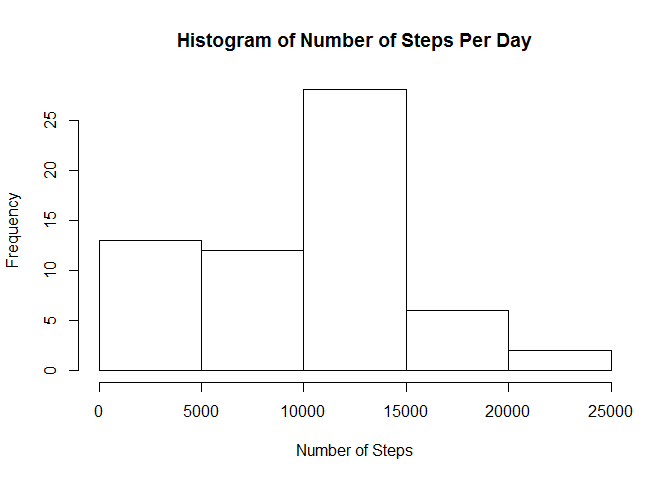
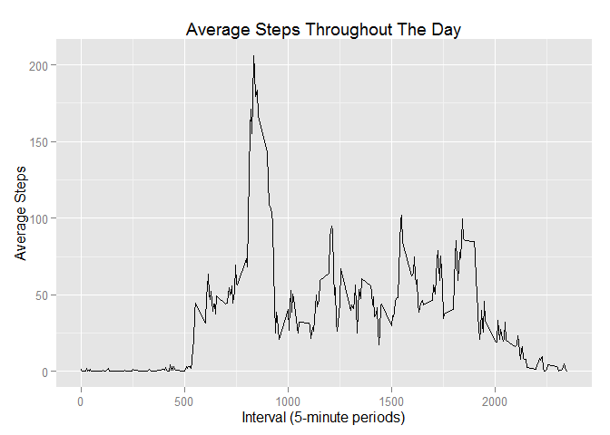
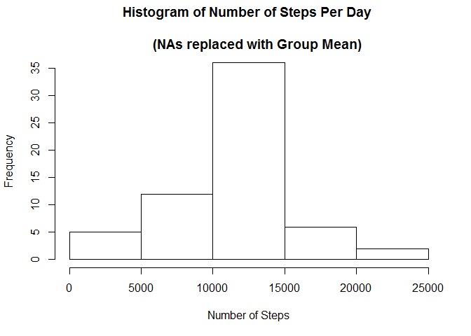
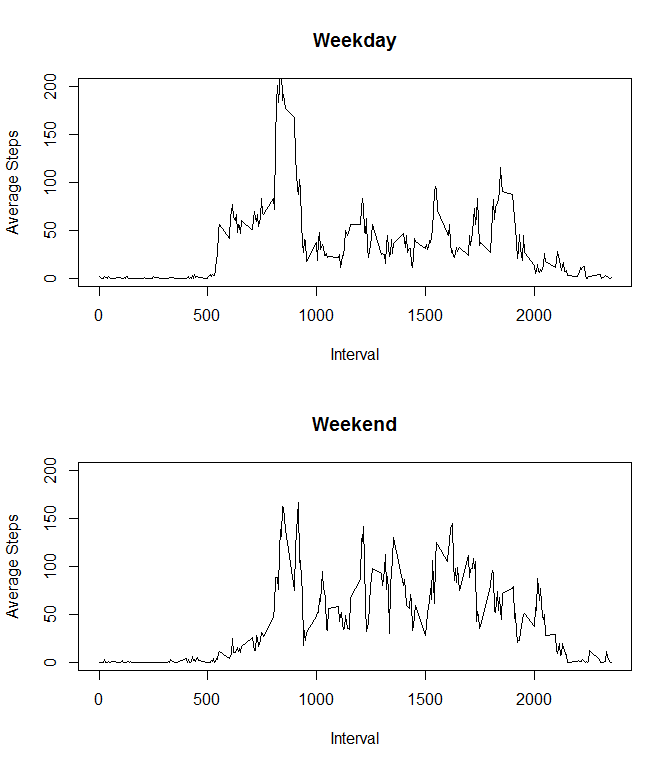

# Reproducible Data
awgooding  
January 9, 2016  


###**Loading and preprocessing the data**

Loads necessary packages.

```r
suppressMessages(library(plyr))
suppressMessages(library(dplyr))
```

```
## Warning: package 'dplyr' was built under R version 3.2.3
```

```r
suppressMessages(library(ggplot2))
```

1. Loads data
2. converts date column to Date object.

```r
setwd("C:/Users/Andrew/Documents/Coursera/Reproducible Research/RepData_PeerAssessment1")
d<-read.csv("activity/activity.csv",stringsAsFactors = FALSE)
d$date<-as.Date(d$date,"%Y-%m-%d")
```


###**What is mean total number of steps taken per day?**

1. Creates a data frame with the total number of steps taken for each day.

```r
d.sum<-ddply(d,.(date),summarize,steps.sum = sum(steps,na.rm = TRUE))
head(d.sum,25)
```

```
##          date steps.sum
## 1  2012-10-01         0
## 2  2012-10-02       126
## 3  2012-10-03     11352
## 4  2012-10-04     12116
## 5  2012-10-05     13294
## 6  2012-10-06     15420
## 7  2012-10-07     11015
## 8  2012-10-08         0
## 9  2012-10-09     12811
## 10 2012-10-10      9900
## 11 2012-10-11     10304
## 12 2012-10-12     17382
## 13 2012-10-13     12426
## 14 2012-10-14     15098
## 15 2012-10-15     10139
## 16 2012-10-16     15084
## 17 2012-10-17     13452
## 18 2012-10-18     10056
## 19 2012-10-19     11829
## 20 2012-10-20     10395
## 21 2012-10-21      8821
## 22 2012-10-22     13460
## 23 2012-10-23      8918
## 24 2012-10-24      8355
## 25 2012-10-25      2492
```

2. Creates a histogram of the total number of steps taken each day.

```r
hist(d.sum$steps.sum,main = "Histogram of Number of Steps Per Day", 
     xlab = "Number of Steps")
```

 

3. Mean number of steps per day.

```r
mean(d.sum$steps.sum)
```

```
## [1] 9354.23
```

3. Median number of steps per day.

```r
median(d.sum$steps.sum)
```

```
## [1] 10395
```


###**What is the average daily activity pattern?**

1. Breaks data down by intervals and calculates the mean, ignoring NAs. Plots
the output.

```r
d.avg.daily <- ddply(d,.(interval),summarize, 
                     steps.interval.mean = mean(steps, na.rm = TRUE))
qplot(x = interval, y = steps.interval.mean,data = d.avg.daily, 
      geom = "line",
      main = "Average Steps Throughout The Day",
      ylab = "Average Steps",
      xlab = "Interval (5-minute periods)")
```

 


2. Selects the row with the maximum average daily steps.

```r
d.avg.daily[which.max(d.avg.daily[,"steps.interval.mean"]),]
```

```
##     interval steps.interval.mean
## 104      835            206.1698
```


###**Inputting Missing Values**

1. Finds number of incomplete rows.

```r
sum(!complete.cases(d))
```

```
## [1] 2304
```

2. Creates function to fill in the NAs with the average for the relevant interval.

```r
impute.mean <- function(x) replace(x, is.na(x), mean(x, na.rm = TRUE))
```

3. Creates new dataset with missing data filled in using impute.mean()

```r
d.na.replaced <- ddply(d, ~ interval, mutate, steps = impute.mean(steps))
```

4. Sums the total number of steps for each day and creates a histogram.

```r
d.sum.na.replaced<-ddply(d.na.replaced,.(date),summarize,steps.sum = sum(steps,na.rm = TRUE))
hist(d.sum.na.replaced$steps.sum,main = "Histogram of Number of Steps Per Day \n
     (NAs replaced with Group Mean)", 
     xlab = "Number of Steps")
```

 

Mean number of steps per day, NAs replaced.

```r
mean(d.sum.na.replaced$steps.sum)
```

```
## [1] 10766.19
```

Median number of steps per day, NAs replaced.

```r
median(d.sum.na.replaced$steps.sum)
```

```
## [1] 10766.19
```

*These are higher than the mean and median calculated from the original data set. Inputting missing data with the group average raises the estimate for total daily number of steps. 


###**Are there differences in activity patterns between weekdays and weekends?**


1. Create weekend/weekday factor variables.

```r
v.weekdays <- c("Mon","Tue","Wed","Thu","Fri")
d.na.replaced$daytype <- factor((weekdays(d.na.replaced$date, abbreviate  =                                  TRUE) %in% v.weekdays), 
                                 levels = c(TRUE,FALSE),
                                 labels = c("weekday","weekend"))
```

Creates separate summary data frames for weekdays and weekends.

```r
d.na.replaced.weekday.mean <- ddply(filter(d.na.replaced, 
                                           daytype == "weekday"),
                                    .(interval),summarize,
                                    weekday.avg = mean(steps))
d.na.replaced.weekend.mean <- ddply(filter(d.na.replaced, 
                                           daytype == "weekend"),
                                    .(interval),summarize,
                                    weekend.avg = mean(steps))
```


2. Panel plot showing the differences between Weekday and Weekend averages by interval.

```r
par(mfrow = c(2,1))
plot(x = d.na.replaced.weekday.mean$interval, 
     y = d.na.replaced.weekday.mean$weekday.avg, 
     type = "l",
     ylab = "Average Steps",
     xlab = "Interval",
     main = "Weekday",
     ylim = c(0,200))
plot(x = d.na.replaced.weekend.mean$interval, 
     y = d.na.replaced.weekend.mean$weekend.avg, 
     type = "l",
     ylab = "Average Steps",
     xlab = "Interval",
     main = "Weekend",
     ylim = c(0,200))
```

 


## Thanks for reading!
